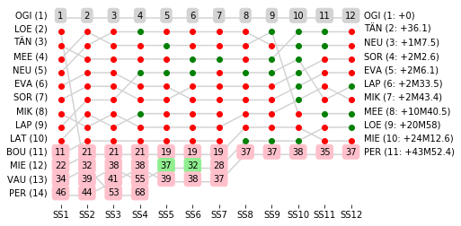

# Rally Report - France

*This report is unofficial and is not associated in any way with the Fédération Internationale de l’Automobile (FIA) or WRC Promoter GmbH.*

Tour de Corse (2018-04-05 to 2018-04-08) runs over 12 competitive special stages. The distance covered on the special stages is 333.48km, with an overall rally distance of 1453.16km. The special stage surface type is predominantly Tarmac.

# Rally Report - France

*This report is unofficial and is not associated in any way with the Fédération Internationale de l’Automobile (FIA) or WRC Promoter GmbH.*

Tour de Corse (2018-04-05 to 2018-04-08) runs over 12 competitive special stages. The distance covered on the special stages is 333.48km, with an overall rally distance of 1453.16km. The special stage surface type is predominantly Tarmac.

# Rally Report - France

*This report is unofficial and is not associated in any way with the Fédération Internationale de l’Automobile (FIA) or WRC Promoter GmbH.*

Tour de Corse (2018-04-05 to 2018-04-08) runs over 12 competitive special stages. The distance covered on the special stages is 333.48km, with an overall rally distance of 1453.16km. The special stage surface type is predominantly Tarmac.

