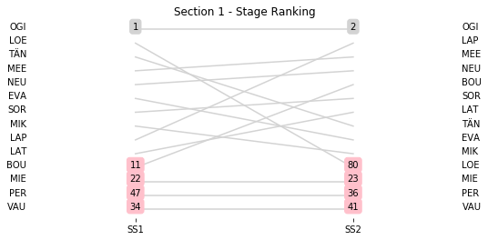
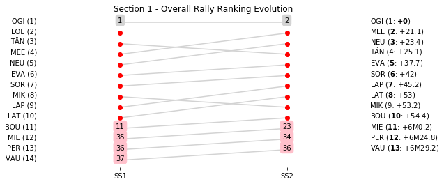

# Section 1, Friday 6 April 2018

This section comprises two special stages (SS1 - La Porta - Valle di Rostino 1 (49.03km), SS2 - Piedigriggio - Pont de Castirla 1 (13.55km))

The full scheduled itinerary for the section was as follows:

	- 08:00:00 TC0 Parc Ferme OUT - Bastia Place Saint-Nicolas  [00:00:00]
	- 08:40:00 TC0A Service IN - Bastia airport (22.85km) [00:40:00]
	- 08:55:00 TC0B Service OUT                            [00:15:00]
	- 09:47:00 TC1 La Porta (31.79km) [00:52:00]
	- 09:50:00 SS1 La Porta - Valle di Rostino 1 (49.03km) [00:03:00]
	- 11:06:00 TC2 Piedigriggio (63.89km) [01:16:00]
	- 11:09:00 SS2 Piedigriggio - Pont de Castirla 1 (13.55km) [00:03:00]
	- 12:22:00 TC2A Regroup & Technical Zone IN - Bastia airport (59.7km) [01:13:00]

### Section 1 Report
Section 1

Section 1

