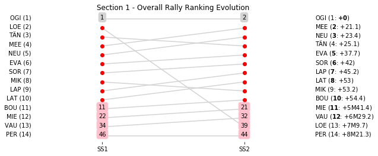

# Section 1, Friday 6 April 2018

This section comprises two special stages (SS1 - La Porta - Valle di Rostino 1 (49.03km), SS2 - Piedigriggio - Pont de Castirla 1 (13.55km))

The full scheduled itinerary for the section was as follows:

	- 08:00:00 TC0 Parc Ferme OUT - Bastia Place Saint-Nicolas  [00:00:00]
	- 08:40:00 TC0A Service IN - Bastia airport (22.85km) [00:40:00]
	- 08:55:00 TC0B Service OUT                            [00:15:00]
	- 09:47:00 TC1 La Porta (31.79km) [00:52:00]
	- 09:50:00 SS1 La Porta - Valle di Rostino 1 (49.03km) [00:03:00]
	- 11:06:00 TC2 Piedigriggio (63.89km) [01:16:00]
	- 11:09:00 SS2 Piedigriggio - Pont de Castirla 1 (13.55km) [00:03:00]
	- 12:22:00 TC2A Regroup & Technical Zone IN - Bastia airport (59.7km) [01:13:00]

### Section 1 Report
Section 1

Section 1

Stage Result - SS1

|Driver|            Team             |Elapsed Duration|Position|Class Rank|   diffFirst    |    diffPrev    |
|------|-----------------------------|----------------|-------:|---------:|----------------|----------------|
|OGI   |M-SPORT FORD WORLD RALLY TEAM|00:31:53.8000000|       1|         1|00:00:00        |00:00:00        |
|LOE   |CITROEN TOTAL ABU DHABI WRT  |00:32:03.5000000|       2|         2|00:00:09.7000000|00:00:09.7000000|
|TÄN   |TOYOTA GAZOO RACING WRT      |00:32:11.9000000|       3|         3|00:00:18.1000000|00:00:08.4000000|
|MEE   |CITROEN TOTAL ABU DHABI WRT  |00:32:12.9000000|       4|         4|00:00:19.1000000|00:00:01        |
|NEU   |HYUNDAI SHELL MOBIS WRT      |00:32:15        |       5|         5|00:00:21.2000000|00:00:02.1000000|
|EVA   |M-SPORT FORD WORLD RALLY TEAM|00:32:24.3000000|       6|         6|00:00:30.5000000|00:00:09.3000000|
|SOR   |HYUNDAI SHELL MOBIS WRT      |00:32:29.8000000|       7|         7|00:00:36        |00:00:05.5000000|
|MIK   |HYUNDAI SHELL MOBIS WRT      |00:32:32.9000000|       8|         8|00:00:39.1000000|00:00:03.1000000|
|LAP   |TOYOTA GAZOO RACING WRT      |00:32:37        |       9|         9|00:00:43.2000000|00:00:04.1000000|
|LAT   |TOYOTA GAZOO RACING WRT      |00:32:40        |      10|        10|00:00:46.2000000|00:00:03        |
|BOU   |M-SPORT FORD WORLD RALLY TEAM|00:32:44.2000000|      11|        11|00:00:50.4000000|00:00:04.2000000|
|MIE   |MAURO MIELE                  |00:36:18.1000000|      22|        12|00:04:24.3000000|00:00:21        |
|VAU   |ALAIN VAUTHIER               |00:36:36.9000000|      34|        13|00:04:43.1000000|00:00:00        |
|PER   |ARMANDO PEREIRA              |00:38:33.4000000|      47|        14|00:06:39.6000000|00:00:00.9000000|

Stage Result - SS2

|Driver|            Team             |Elapsed Duration|Position|Class Rank|   diffFirst    |    diffPrev    |
|------|-----------------------------|----------------|-------:|---------:|----------------|----------------|
|OGI   |M-SPORT FORD WORLD RALLY TEAM|00:07:59.9000000|       1|         1|00:00:00        |00:00:00        |
|LAP   |TOYOTA GAZOO RACING WRT      |00:08:01.9000000|       2|         2|00:00:02        |00:00:02        |
|MEE   |CITROEN TOTAL ABU DHABI WRT  |00:08:01.9000000|       3|         3|00:00:02        |00:00:00        |
|NEU   |HYUNDAI SHELL MOBIS WRT      |00:08:02.1000000|       4|         4|00:00:02.2000000|00:00:00.2000000|
|BOU   |M-SPORT FORD WORLD RALLY TEAM|00:08:03.9000000|       5|         5|00:00:04        |00:00:01.8000000|
|SOR   |HYUNDAI SHELL MOBIS WRT      |00:08:05.9000000|       6|         6|00:00:06        |00:00:02        |
|LAT   |TOYOTA GAZOO RACING WRT      |00:08:06.7000000|       7|         7|00:00:06.8000000|00:00:00.8000000|
|TÄN   |TOYOTA GAZOO RACING WRT      |00:08:06.9000000|       8|         8|00:00:07        |00:00:00.2000000|
|EVA   |M-SPORT FORD WORLD RALLY TEAM|00:08:07.1000000|       9|         9|00:00:07.2000000|00:00:00.2000000|
|MIK   |HYUNDAI SHELL MOBIS WRT      |00:08:14        |      10|        10|00:00:14.1000000|00:00:06.9000000|
|MIE   |MAURO MIELE                  |00:09:17        |      23|        11|00:01:17.1000000|00:00:02.5000000|
|PER   |ARMANDO PEREIRA              |00:09:41.6000000|      36|        12|00:01:41.7000000|00:00:00.9000000|
|VAU   |ALAIN VAUTHIER               |00:09:46        |      41|        13|00:01:46.1000000|00:00:00.1000000|
|LOE   |CITROEN TOTAL ABU DHABI WRT  |00:14:59.9000000|      80|        14|00:07:00        |00:02:00.6000000|

