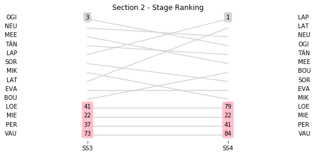
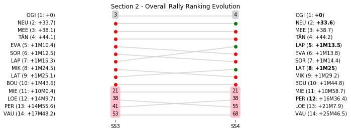

# Section 2, Friday 6 April 2018

This section comprises two special stages (SS3 - La Porta - Valle di Rostino 2 (49.03km), SS4 - Piedigriggio - Pont de Castirla 2 (13.55km))

The full scheduled itinerary for the section was as follows:

	- 13:47:00 TC2B Regroup OUT - Service IN  [01:25:00]
	- 14:17:00 TC2C Service OUT                            [00:30:00]
	- 15:09:00 TC3 La Porta (31.79km) [00:52:00]
	- 15:12:00 SS3 La Porta - Valle di Rostino 2 (49.03km) [00:03:00]
	- 16:28:00 TC4 Piedigriggio (63.89km) [01:16:00]
	- 16:31:00 SS4 Piedigriggio - Pont de Castirla 2 (13.55km) [00:03:00]
	- 18:06:00 TC4A Bastia Place Saint-Nicolas (77.98km) [01:35:00]
	- 18:51:00 TC4B Technical Zone IN - Bastia airport (22.72km) [00:45:00]
	- 19:01:00 TC4C Technical Zone OUT - Flexi Service IN  [00:10:00]
	- 19:46:00 TC4D Flexi Service OUT & Parc Ferme IN - Bastia airport  [00:45:00]

### Section 2 Report
Section 2

Section 2

Stage Result - SS3

|Driver|            Team             |Elapsed Duration|Position|Class Rank|   diffFirst    |    diffPrev    |
|------|-----------------------------|----------------|-------:|---------:|----------------|----------------|
|OGI   |M-SPORT FORD WORLD RALLY TEAM|00:31:44.1000000|       1|         1|00:00:00        |00:00:00        |
|NEU   |HYUNDAI SHELL MOBIS WRT      |00:31:54.4000000|       2|         2|00:00:10.3000000|00:00:10.3000000|
|MEE   |CITROEN TOTAL ABU DHABI WRT  |00:32:01.1000000|       3|         3|00:00:17        |00:00:06.7000000|
|TÄN   |TOYOTA GAZOO RACING WRT      |00:32:03.1000000|       4|         4|00:00:19        |00:00:02        |
|LAP   |TOYOTA GAZOO RACING WRT      |00:32:14.2000000|       5|         5|00:00:30.1000000|00:00:11.1000000|
|SOR   |HYUNDAI SHELL MOBIS WRT      |00:32:14.6000000|       6|         6|00:00:30.5000000|00:00:00.4000000|
|MIK   |HYUNDAI SHELL MOBIS WRT      |00:32:15.4000000|       7|         7|00:00:31.3000000|00:00:00.8000000|
|LAT   |TOYOTA GAZOO RACING WRT      |00:32:16.2000000|       8|         8|00:00:32.1000000|00:00:00.8000000|
|EVA   |M-SPORT FORD WORLD RALLY TEAM|00:32:16.8000000|       9|         9|00:00:32.7000000|00:00:00.6000000|
|BOU   |M-SPORT FORD WORLD RALLY TEAM|00:32:33.3000000|      10|        10|00:00:49.2000000|00:00:16.5000000|
|MIE   |MAURO MIELE                  |00:36:03.1000000|      22|        11|00:04:19        |00:00:24.3000000|
|PER   |ARMANDO PEREIRA              |00:38:18.4000000|      37|        12|00:06:34.3000000|00:00:00.9000000|
|LOE   |CITROEN TOTAL ABU DHABI WRT  |00:38:44.1000000|      41|        13|00:07:00        |00:00:00.3000000|
|VAU   |ALAIN VAUTHIER               |00:43:03.1000000|      74|        14|00:11:19        |00:00:21.7000000|

Stage Result - SS4

|Driver|            Team             |Elapsed Duration|Position|Class Rank|   diffFirst    |    diffPrev    |
|------|-----------------------------|----------------|-------:|---------:|----------------|----------------|
|LAP   |TOYOTA GAZOO RACING WRT      |00:07:59.4000000|       1|         1|00:00:00        |00:00:00        |
|LAT   |TOYOTA GAZOO RACING WRT      |00:08:01.1000000|       2|         2|00:00:01.7000000|00:00:01.7000000|
|NEU   |HYUNDAI SHELL MOBIS WRT      |00:08:01.1000000|       3|         3|00:00:01.7000000|00:00:00        |
|OGI   |M-SPORT FORD WORLD RALLY TEAM|00:08:01.2000000|       4|         4|00:00:01.8000000|00:00:00.1000000|
|TÄN   |TOYOTA GAZOO RACING WRT      |00:08:01.3000000|       5|         5|00:00:01.9000000|00:00:00.1000000|
|MEE   |CITROEN TOTAL ABU DHABI WRT  |00:08:01.8000000|       6|         6|00:00:02.4000000|00:00:00.5000000|
|BOU   |M-SPORT FORD WORLD RALLY TEAM|00:08:02.4000000|       7|         7|00:00:03        |00:00:00.6000000|
|SOR   |HYUNDAI SHELL MOBIS WRT      |00:08:03.1000000|       8|         8|00:00:03.7000000|00:00:00.7000000|
|EVA   |M-SPORT FORD WORLD RALLY TEAM|00:08:04.6000000|       9|         9|00:00:05.2000000|00:00:01.5000000|
|MIK   |HYUNDAI SHELL MOBIS WRT      |00:08:05.9000000|      10|        10|00:00:06.5000000|00:00:01.3000000|
|MIE   |MAURO MIELE                  |00:08:59.5000000|      22|        11|00:01:00.1000000|00:00:00.8000000|
|PER   |ARMANDO PEREIRA              |00:09:42        |      41|        12|00:01:42.6000000|00:00:00.6000000|
|LOE   |CITROEN TOTAL ABU DHABI WRT  |00:14:59.4000000|      79|        13|00:07:00        |00:02:33.9000000|
|VAU   |ALAIN VAUTHIER               |00:15:59.5000000|      84|        14|00:08:00.1000000|00:00:01.3000000|

