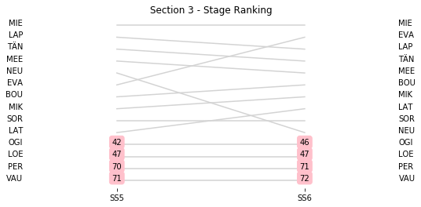
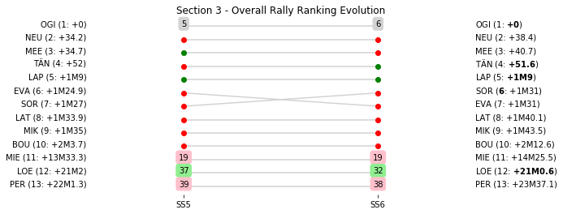

# Section 3, Saturday 7 April 2018

This section comprises two special stages (SS5 - Cagnano - Pino - Canari 1 (35.61km), SS6 - Desert des Agriates 1 (15.45km))

The full scheduled itinerary for the section was as follows:

	- 06:10:00 TC4E Parc Ferme OUT & Service IN - Bastia airport  [00:00:00]
	- 06:25:00 TC4F Service OUT                            [00:15:00]
	- 07:34:00 TC5 Cagnano (48.63km) [01:09:00]
	- 07:37:00 SS5 Cagnano - Pino - Canari 1 (35.61km) [00:03:00]
	- 09:15:00 TC6 Casta (78.61km) [01:38:00]
	- 09:18:00 SS6 Desert des Agriates 1 (15.45km) [00:03:00]
	- 09:57:00 TC6A Regroup IN - Lile Rousse (32.71km) [00:39:00]

### Section 3 Report
Section 3

Section 3

