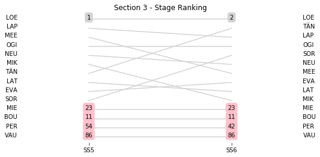

# Section 3, Saturday 7 April 2018

This section comprises two special stages (SS5 - Cagnano - Pino - Canari 1 (35.61km), SS6 - Desert des Agriates 1 (15.45km))

The full scheduled itinerary for the section was as follows:

	- 06:10:00 TC4E Parc Ferme OUT & Service IN - Bastia airport  [00:00:00]
	- 06:25:00 TC4F Service OUT                            [00:15:00]
	- 07:34:00 TC5 Cagnano (48.63km) [01:09:00]
	- 07:37:00 SS5 Cagnano - Pino - Canari 1 (35.61km) [00:03:00]
	- 09:15:00 TC6 Casta (78.61km) [01:38:00]
	- 09:18:00 SS6 Desert des Agriates 1 (15.45km) [00:03:00]
	- 09:57:00 TC6A Regroup IN - Lile Rousse (32.71km) [00:39:00]

### Section 3 Report
Section 3

Section 3

Stage Result - SS5

|Driver|            Team             |Elapsed Duration|Position|Class Rank|   diffFirst    |    diffPrev    |
|------|-----------------------------|----------------|-------:|---------:|----------------|----------------|
|LOE   |CITROEN TOTAL ABU DHABI WRT  |00:21:58.6000000|       1|         1|00:00:00        |00:00:00        |
|LAP   |TOYOTA GAZOO RACING WRT      |00:22:00        |       2|         2|00:00:01.4000000|00:00:01.4000000|
|MEE   |CITROEN TOTAL ABU DHABI WRT  |00:22:00.5000000|       3|         3|00:00:01.9000000|00:00:00.5000000|
|OGI   |M-SPORT FORD WORLD RALLY TEAM|00:22:04.5000000|       4|         4|00:00:05.9000000|00:00:04        |
|NEU   |HYUNDAI SHELL MOBIS WRT      |00:22:05.1000000|       5|         5|00:00:06.5000000|00:00:00.6000000|
|MIK   |HYUNDAI SHELL MOBIS WRT      |00:22:10.3000000|       6|         6|00:00:11.7000000|00:00:05.2000000|
|TÄN   |TOYOTA GAZOO RACING WRT      |00:22:12.3000000|       7|         7|00:00:13.7000000|00:00:02        |
|LAT   |TOYOTA GAZOO RACING WRT      |00:22:13.4000000|       8|         8|00:00:14.8000000|00:00:01.1000000|
|EVA   |M-SPORT FORD WORLD RALLY TEAM|00:22:15.6000000|       9|         9|00:00:17        |00:00:02.2000000|
|SOR   |HYUNDAI SHELL MOBIS WRT      |00:22:17.1000000|      10|        10|00:00:18.5000000|00:00:01.5000000|
|BOU   |M-SPORT FORD WORLD RALLY TEAM|00:22:23.4000000|      11|        11|00:00:24.8000000|00:00:06.3000000|
|MIE   |MAURO MIELE                  |00:24:39.1000000|      23|        12|00:02:40.5000000|00:00:11.1000000|
|PER   |ARMANDO PEREIRA              |00:27:29.4000000|      54|        13|00:05:30.8000000|00:00:00.5000000|
|VAU   |ALAIN VAUTHIER               |                |      86|        14|                |                |

Stage Result - SS6

|Driver|            Team             |Elapsed Duration|Position|Class Rank|   diffFirst    |    diffPrev    |
|------|-----------------------------|----------------|-------:|---------:|----------------|----------------|
|LOE   |CITROEN TOTAL ABU DHABI WRT  |00:08:32.4000000|       1|         1|00:00:00        |00:00:00        |
|TÄN   |TOYOTA GAZOO RACING WRT      |00:08:33.4000000|       2|         2|00:00:01        |00:00:01        |
|LAP   |TOYOTA GAZOO RACING WRT      |00:08:33.8000000|       3|         3|00:00:01.4000000|00:00:00.4000000|
|OGI   |M-SPORT FORD WORLD RALLY TEAM|00:08:33.8000000|       4|         4|00:00:01.4000000|00:00:00        |
|SOR   |HYUNDAI SHELL MOBIS WRT      |00:08:37.8000000|       5|         5|00:00:05.4000000|00:00:04        |
|NEU   |HYUNDAI SHELL MOBIS WRT      |00:08:38        |       6|         6|00:00:05.6000000|00:00:00.2000000|
|MEE   |CITROEN TOTAL ABU DHABI WRT  |00:08:39.8000000|       7|         7|00:00:07.4000000|00:00:01.8000000|
|EVA   |M-SPORT FORD WORLD RALLY TEAM|00:08:39.9000000|       8|         8|00:00:07.5000000|00:00:00.1000000|
|LAT   |TOYOTA GAZOO RACING WRT      |00:08:40        |       9|         9|00:00:07.6000000|00:00:00.1000000|
|MIK   |HYUNDAI SHELL MOBIS WRT      |00:08:42.3000000|      10|        10|00:00:09.9000000|00:00:02.3000000|
|BOU   |M-SPORT FORD WORLD RALLY TEAM|00:08:42.7000000|      11|        11|00:00:10.3000000|00:00:00.4000000|
|MIE   |MAURO MIELE                  |00:09:26        |      23|        12|00:00:53.6000000|00:00:00.4000000|
|PER   |ARMANDO PEREIRA              |00:10:09.6000000|      42|        13|00:01:37.2000000|00:00:00.1000000|
|VAU   |ALAIN VAUTHIER               |                |      86|        14|                |                |

