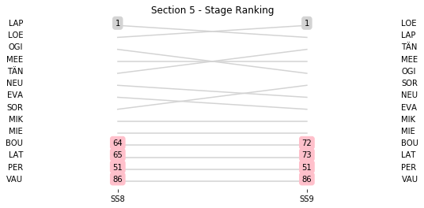
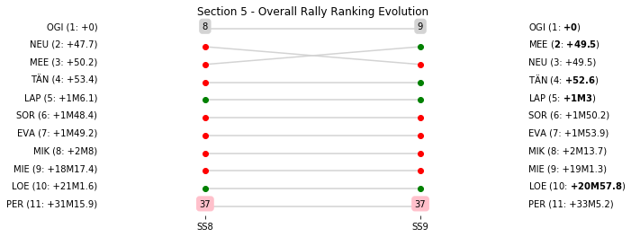

# Section 5, Saturday 7 April 2018

This section comprises two special stages (SS8 - Cagnano - Pino - Canari 2 (35.61km), SS9 - Desert des Agriates 2 (15.45km))

The full scheduled itinerary for the section was as follows:

	- 13:31:00 TC7B Regroup OUT - Service IN  [01:02:00]
	- 14:01:00 TC7C Service OUT                            [00:30:00]
	- 15:18:00 TC8 Cagnano (49.03km) [01:17:00]
	- 15:21:00 SS8 Cagnano - Pino - Canari 2 (35.61km) [00:03:00]
	- 16:59:00 TC9 Casta (78.61km) [01:38:00]
	- 17:02:00 SS9 Desert des Agriates 2 (15.45km) [00:03:00]
	- 17:41:00 TC9A Regroup IN - Lile Rousse (32.71km) [00:39:00]

### Section 5 Report
Section 5

Section 5

